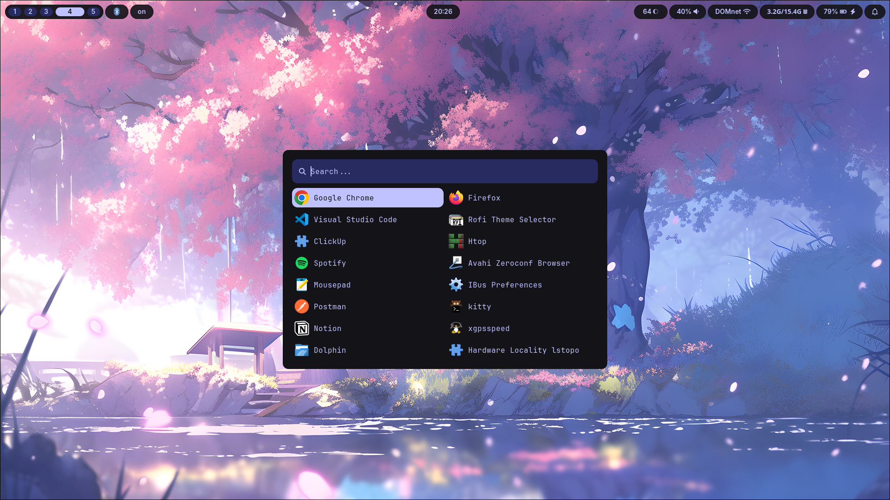
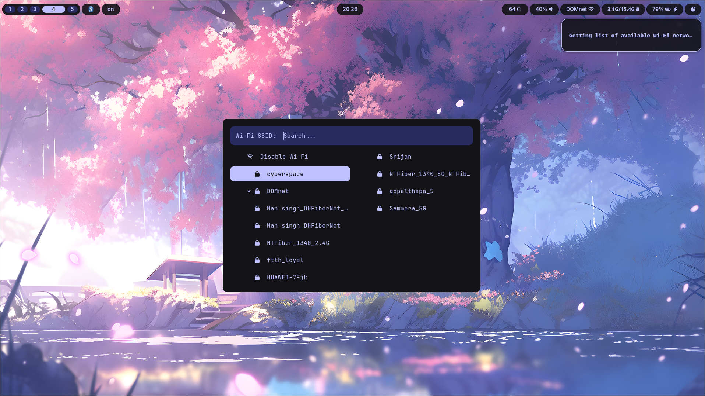
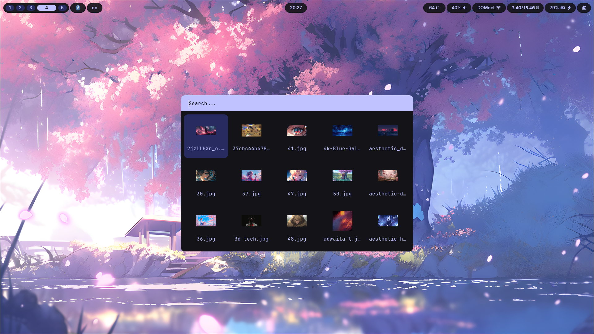
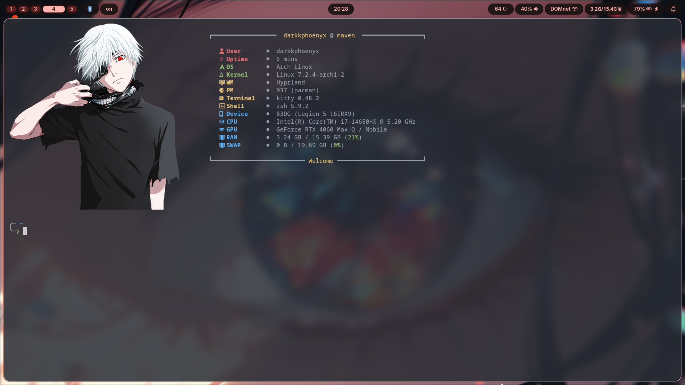
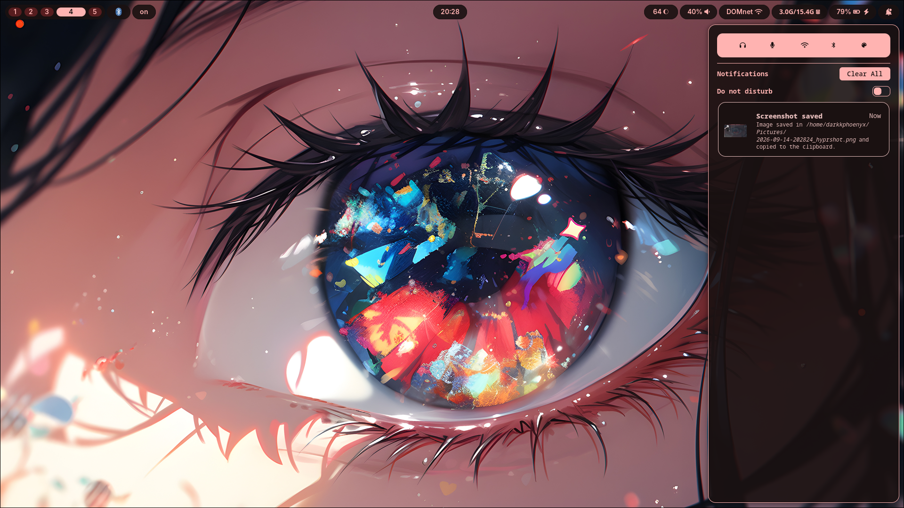
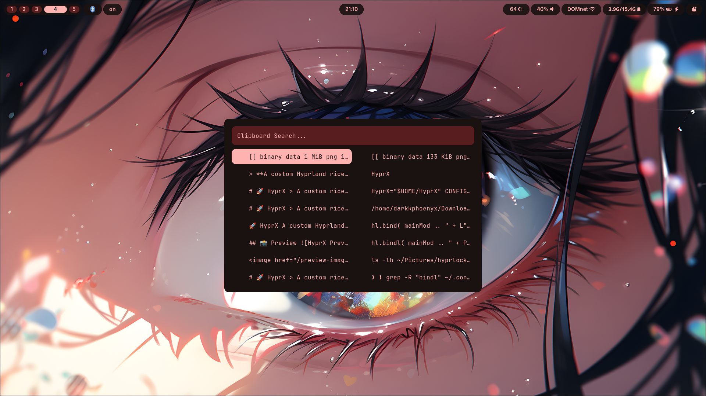
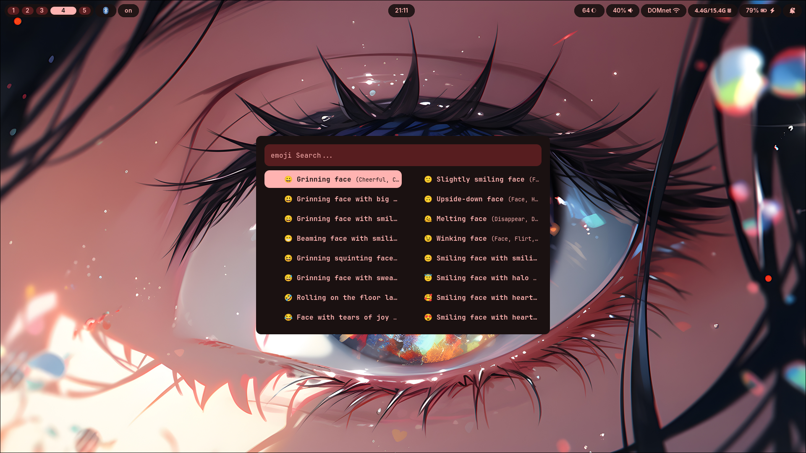
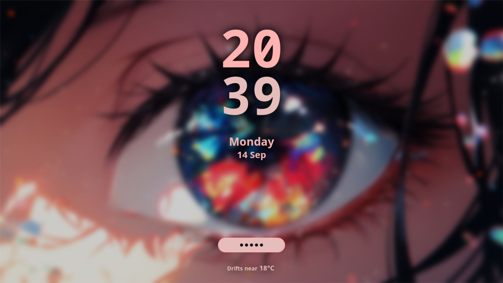

# 🚀 HyprX

> **A custom Hyprland rice built from scratch — minimal, and mine.**

HyprX is my personal **Hyprland rice**, built over weeks of breaking configurations, fixing them, experimenting, and learning Linux the hard way.

This repository contains everything that makes up my desktop environment — from Hyprland and Waybar to Kitty, Rofi, shell theming, notifications, and dynamic color generation.

**Feel free to rice it to your taste.**

<p align="center">
  
</p>

---

## 📸 Preview














---

## ✨ Features

- ⚡ Hyprland-based Wayland desktop
- 🖥️ Clean, minimal, and distraction-free interface
- 🎨 Custom Waybar, Rofi, Kitty, and SwayNC configurations
- 🎨 Matugen-powered dynamic theming
- 🔔 SwayNC notification system
- 🌙 Hyprsunset for night-light and blue-light filtering
- 🧠 Zsh with Oh My Zsh and Powerlevel10k
- 🔗 Fully symlinked configuration structure
- 📦 Automated installation and setup
- 🖼️ Wallpaper-based automatic color generation
- ⚙️ Centralized configuration managed entirely from the repository

---

## 🧩 Components

- 🪟 **Window Manager:** Hyprland
- 📊 **Status Bar:** Waybar
- 🚀 **Application Launcher:** Rofi
- 🖥️ **Terminal:** Kitty
- 🔔 **Notifications:** SwayNC
- 🌙 **Night Light:** Hyprsunset
- 🎨 **Theming:** Matugen
- 🐚 **Shell:** Zsh
- 🧠 **Shell Framework:** Oh My Zsh
- ⚡ **Prompt:** Powerlevel10k

---

## 🎨 Theming

HyprX uses **Matugen** to dynamically generate a color palette from the current wallpaper.

The generated palette is shared across the different components of the desktop, keeping the entire environment visually consistent.

Change the wallpaper, regenerate the palette, and the desktop takes on an entirely new look.

---

## ⚙️ Installation

> ⚠️ **Do NOT run the installer as root.**

### 1. Clone the repository

```bash
git clone https://github.com/darkkphoenyx/HyprX
cd HyprX
```

### 2. Run the installer

```bash
./install.sh
```

> That's it. <br>
> The installer handles the required packages, configuration files, symlinks, and theming setup.

---

## ⌨️ Keybindings

HyprX is designed around a keyboard-driven workflow.

All Hyprland keybindings can be found inside the Hyprland configuration.

```bash
cat ~/.config/hypr/keybinds.lua
```

---

<p align="center">
  
</p>
